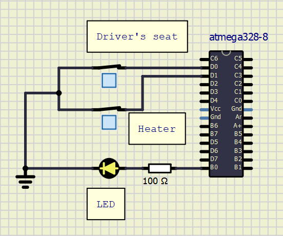
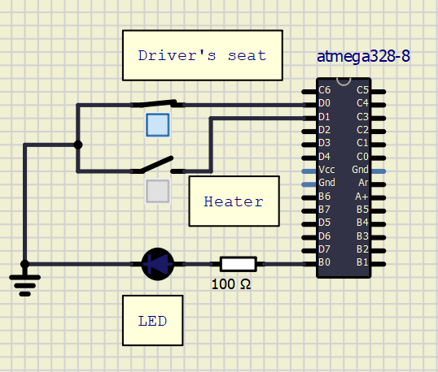
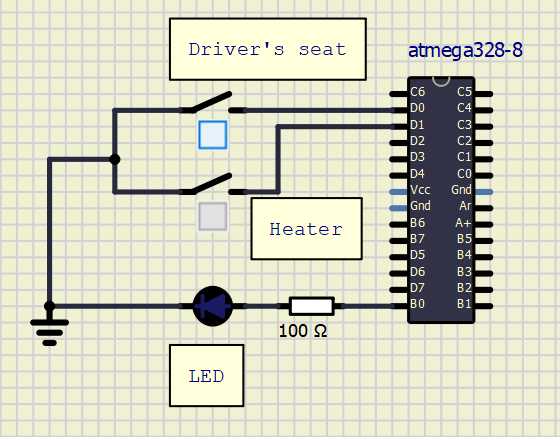
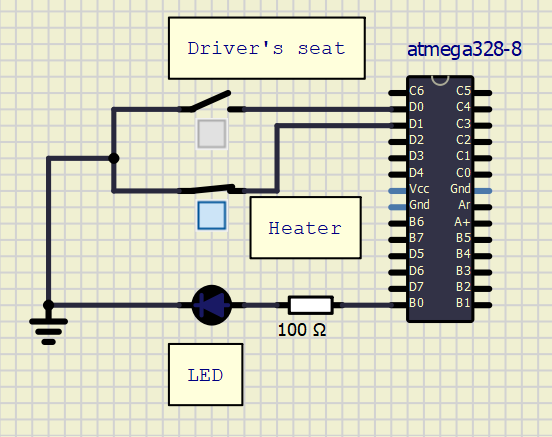

# Activity 1: Triggering a LED when both driver's seat and heater is detected

# LED ON 

# LED OFF 
## Case 1: Driver seat on, heater off

## Case 2: Driver seat off, heater off

## Case 1: Driver seat off, heater on

