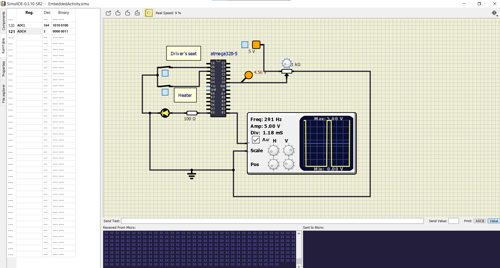

# Embedded Case Study
### ID: 256305

## In Action-ON 

## In Action
### OFF, when neither the driver is seated nor the heater is switched on

### OFF, when the driver is seated but the heater is not switched on

### OFF, when the driver is not seated but the heater is switched on

#### CI and Code Quality

|Build|Cppcheck|Codacy|
|:--:|:--:|:--:|
||||

